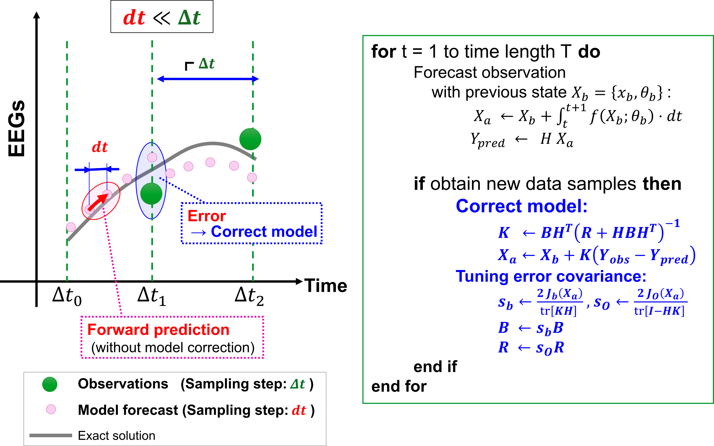

# EEG_3DVAR_network_mEIest

There are sample scripts of our prpoposed EEG data assimilation method with noise adaptive 3DVAR. 
<br><br>



# References<br>
Hiroshi Yokoyama, and Keiichi Kitajo,  
Numerical validation of 3D-VAR data assimilation for estimating network dynamics in multivariate EEGs, bioRxiv preprint, 2025. Accepted in Proc. ICONIP2025 <br>
doi: https://doi.org/10.1101/2025.05.22.655248

# Cite<br>

Please cite our repository if you use this code in your own work:
```
@article{Yokoyama2024,
author = {Hiroshi Yokoyama, and Keiichi Kitajo
},
doi = {https://doi.org/10.1101/2025.05.22.655248},
journal = {bioRxiv},
title = {{Numerical validation of 3D-VAR data assimilation for estimating network dynamics in multivariate EEGs}},
year = {2025}
}
```
```
@software{EEG_3DVAR_network_mEIest,
  author = {Yokoyana H.},
  title = {EEG_3DVAR_network_mEIest},
  url = {https://github.com/myGit-YokoyamaHiroshi/EEG_3DVAR_network_mEIest},
  year = {2025}
}
```
