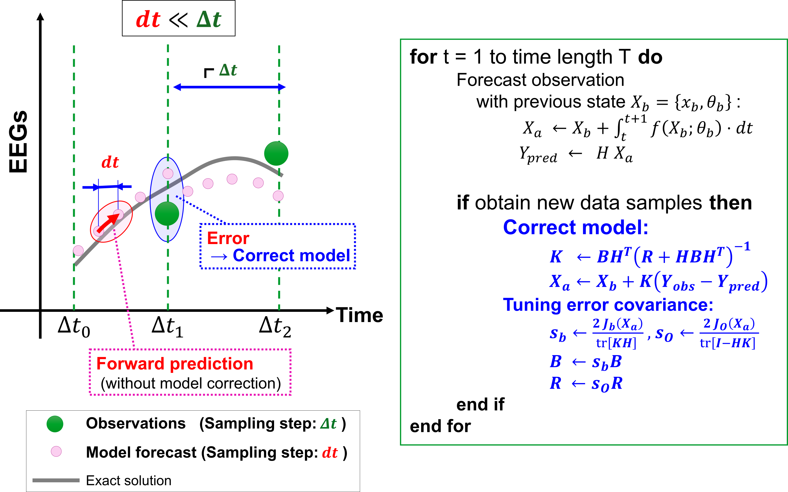

# EEG_3DVAR_network_mEIest

There are sample scripts of our prpoposed EEG data assimilation method with noise adaptive 3DVAR. 
<br><br>



# References<br>
Yokoyama, H., Kitajo, K. (2026). Numerical Validation of 3D-VAR Data Assimilation for Estimating Network Dynamics in Multivariate EEGs. In: Taniguchi, T., et al. Neural Information Processing. ICONIP 2025. Communications in Computer and Information Science, vol 2757. Springer, Singapore.</em> <br>
https://doi.org/10.1007/978-981-95-4100-3_19

# Cite<br>

Please cite our repository if you use this code in your own work:
```
@InProceedings{YokoyamaKitajo_ICONIP2025,
author="Yokoyama, Hiroshi
and Kitajo, Keiichi",
editor="Taniguchi, Tadahiro
and Leung, Chi Sing Andrew
and Kozuno, Tadashi
and Yoshimoto, Junichiro
and Mahmud, Mufti
and Doborjeh, Maryam
and Doya, Kenji",
title="Numerical Validation of 3D-VAR Data Assimilation for Estimating Network Dynamics in Multivariate EEGs",
booktitle="Neural Information Processing",
year="2026",
publisher="Springer Nature Singapore",
address="Singapore",
pages="258--272",
isbn="978-981-95-4100-3"
}
```
```
@software{EEG_3DVAR_network_mEIest,
  author = {Yokoyana H.},
  title = {EEG_3DVAR_network_mEIest},
  url = {https://github.com/myGit-YokoyamaHiroshi/EEG_3DVAR_network_mEIest},
  year = {2025}
}
```
